# SW-EDPN: Physics-Informed Neural Networks for 1D Shallow Water with Wave Breakers

**Course project · MA5307 – Numerical Analysis of PDEs · DIM, FCFM, Universidad de Chile · 2026**  
_Leonardo Ramos · Osvaldo Cartagena_

---

## Abstract

We study the 1D Shallow Water (Saint-Venant) system with variable bottom topography, comparing a Physics-Informed Neural Network (PINN) against a well-balanced Finite Volume Method (FVM) reference solver. The PINN uses a hard-constraint ansatz that encodes the initial condition and the wall boundary condition for velocity exactly by construction, reducing the loss to a pure PDE residual. We test three scenarios of increasing complexity: a stationary lake at rest, a non-stationary Gaussian pulse on a flat bottom, and a wave interacting with a smooth wavebreaker. The PINN reproduces the qualitative and quantitative dynamics of the FVM reference, including the velocity reduction induced by the wavebreaker, with good mass and energy conservation properties for the non-trivial cases.

---

## Physics

### 1D Shallow Water Equations (Saint-Venant System)

The system is defined on $\Omega = (0, 1)$ and $t \in [0, T]$:

$$
\begin{aligned}
\partial_t h + \partial_x (hu) &= 0 \\
\partial_t (hu) + \partial_x \!\left(hu^2 + \tfrac{1}{2} g h^2\right) &= -g h\, \partial_x z
\end{aligned}
$$

with initial conditions $h(x,0) = h_0(x)$, $u(x,0) = u_0(x)$ and wall boundary condition $u|_{\partial\Omega} = 0$.

- $h(x,t)$ — water depth
- $u(x,t)$ — depth-averaged horizontal velocity
- $z(x)$ — fixed bottom topography
- $\eta(x,t) = h + z$ — free surface elevation
- $g = 9.81\ \mathrm{m/s^2}$ — gravitational acceleration

### Conserved Quantities

For smooth solutions:

$$
M(t) = \int_\Omega h \, dx
\qquad\qquad
E(t) = \int_\Omega \left[ \tfrac{1}{2} h u^2 + \tfrac{1}{2} g h^2 + g h z \right] dx
$$

where $M$ is the total mass and $E$ the total mechanical energy.

---

## Methods

### PINN with Hard Constraints

A neural network $\mathrm{NN}_\theta : (x, t) \to \mathbb{R}^2$ parameterises the solution through the ansatz:

$$
\begin{aligned}
h(x,t) &= h_0(x) + t \cdot \mathrm{NN}_h(x, t) \\
u(x,t) &= u_0(x) + t\, x\, (1-x) \cdot \mathrm{NN}_u(x, t)
\end{aligned}
$$

The envelope $t$ ensures $h(x, 0) = h_0(x)$ exactly. The envelope $t\,x\,(1-x)$ ensures $u(x, 0) = u_0(x) = 0$ and $u(0, t) = u(1, t) = 0$ exactly, matching the wall BC for velocity.

The Neumann (zero-gradient) boundary condition for $h$ is not hard-constrained; implementing it to match the FVM reflective BC is planned as future work (see below).

The training loss is the PDE residual only:

$$
\mathcal{L} = \left\| \partial_t h + \partial_x(hu) \right\|^2 + \left\| \partial_t(hu) + \partial_x\!\left(hu^2 + \tfrac{1}{2} g h^2\right) + g h\, \partial_x z \right\|^2
$$

plus an optional positivity penalty (weight 100) to discourage unphysical $h \le 0$.

**Architecture:** MLP with 4 hidden layers of width 64, Tanh activations, inputs normalised to $[-1, 1]^2$.  
**Optimiser:** Adam, lr $= 10^{-3}$, 12 000 steps, 2 048 random collocation points per step.  
**Implementation:** PyTorch, GPU-compatible.

### FVM Reference: Well-Balanced HLL (Berthon & Chalons)

The reference solver implements the well-balanced HLL scheme of Berthon & Chalons [1], which preserves hydrostatic equilibrium ($\partial_x \eta = 0$, $u = 0$) exactly at the discrete level. Parameters:

- $N = 400$ uniform cells, $\mathrm{CFL} = 0.45$
- Reflective (solid-wall) boundary conditions: $q_\mathrm{ghost} = -q_\mathrm{interior}$, $h_\mathrm{ghost} = h_\mathrm{interior}$ (Neumann)

---

## Test Cases and Results

### Case 0 — Stationary Lake at Rest

**Setup:** $\eta(x, 0) = 1$, $z(x) = 0$ (exact steady state).  
Both solvers should preserve $M(t)$ and $E(t)$ to machine precision. Near-zero $L^2$ errors confirm this is a valid sanity check.

<p align="center">
  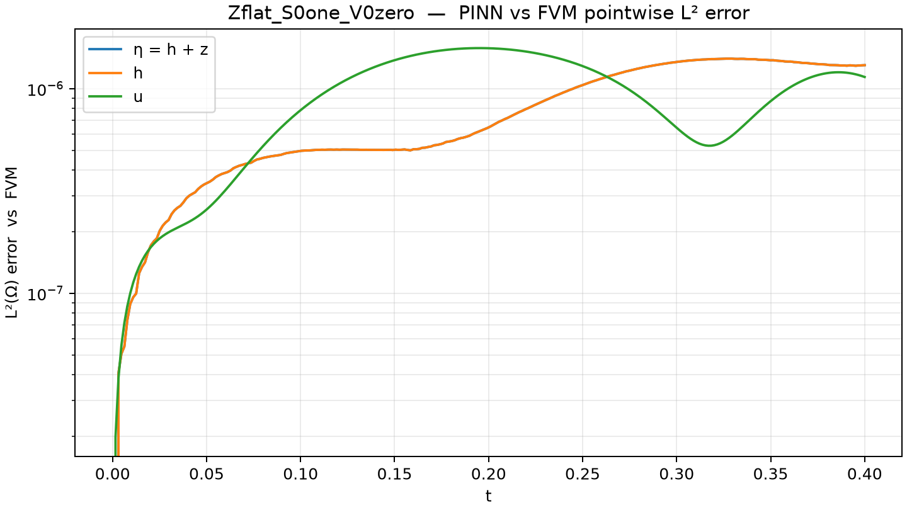
</p>

<details>
<summary>GIF, Hovmöller diagram and conservation</summary>

<p align="center">
  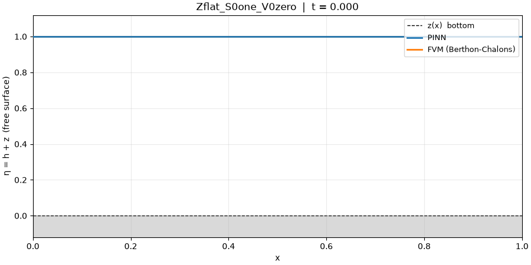
</p>
<p align="center">
  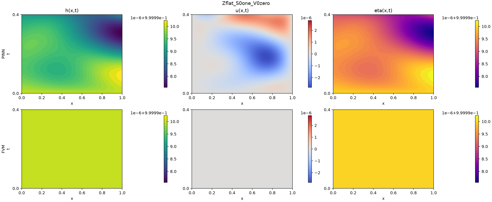
</p>
<p align="center">
  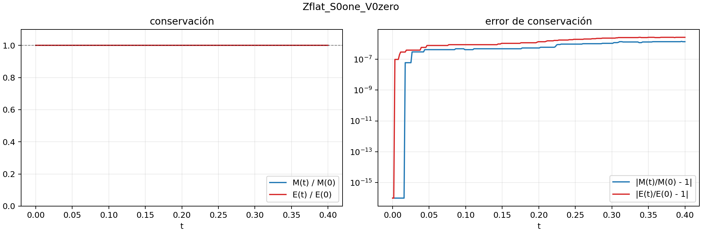
</p>

</details>

### Case 1 — Gaussian Pulse, Flat Bottom

**Setup:** $\eta(x, 0) = 1 + 0.2\, e^{-120 x^2}$, $z(x) = 0$.  
The initial Gaussian pulse disperses symmetrically, converting potential energy into kinetic. The PINN shows good conservation throughout.

<p align="center">
  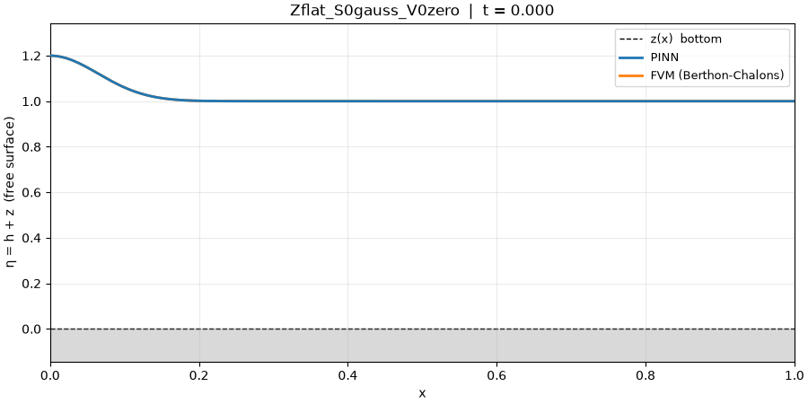
</p>

<details>
<summary>Hovmöller diagram, L² error and conservation</summary>

<p align="center">
  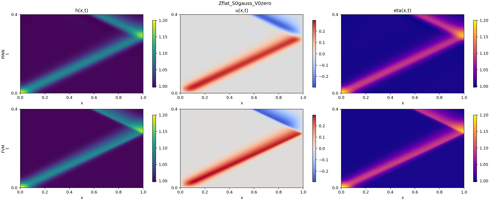
</p>
<p align="center">
  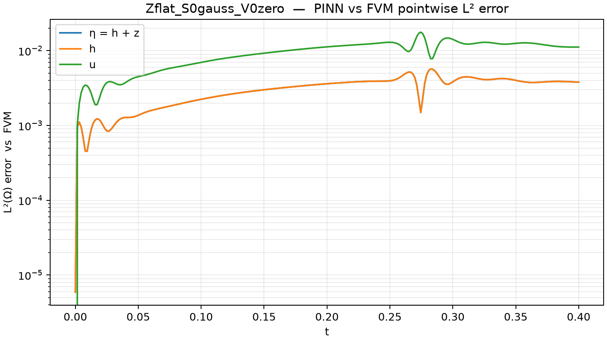
</p>
<p align="center">
  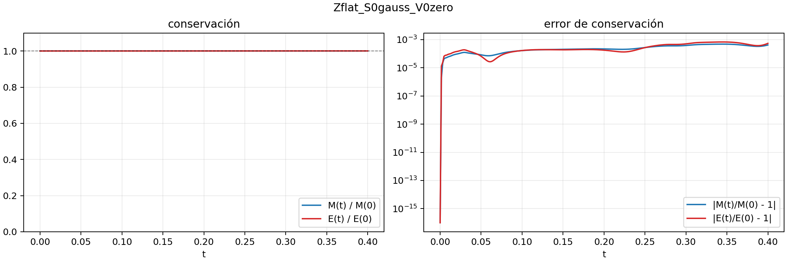
</p>

</details>

### Case 2 — Gaussian Pulse over Wave Breaker

**Setup:**

$$
\eta(x, 0) = 1 + 0.2\, e^{-120 x^2}
\qquad
z(x) = 0.45 \left[ \tanh\big(100(x - 0.4)\big) - \tanh\big(100(x - 0.6)\big) \right]
$$

A smooth bump centred at $x = 0.5$ acts as a wavebreaker. The incoming wave decelerates as it approaches the bump, partially transmits, and partially reflects.

<p align="center">
  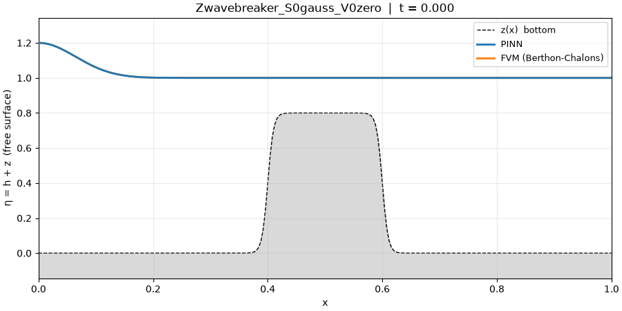
</p>

<details>
<summary>Hovmöller diagram, L² error and conservation</summary>

<p align="center">
  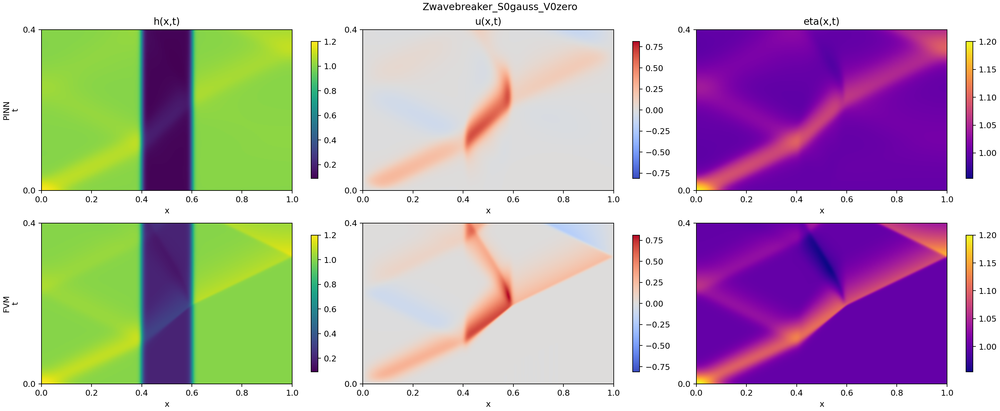
</p>
<p align="center">
  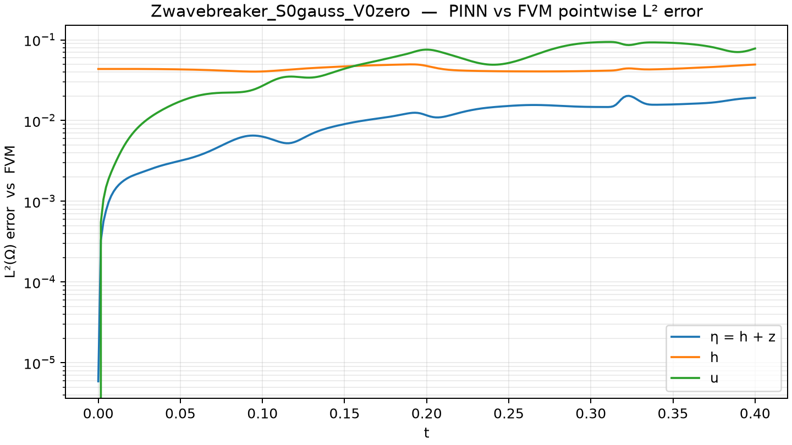
</p>
<p align="center">
  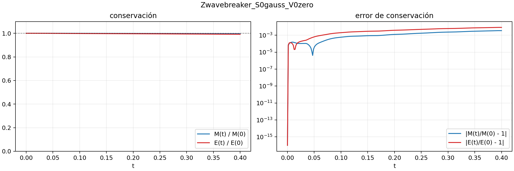
</p>

</details>

Both methods show the same qualitative behaviour: velocity reduction across the breaker and wave splitting. Conservation errors in the PINN are elevated near the sharp topography gradient during the interaction, consistent with higher PDE residuals in that region. The reflected wave amplitude shows some discrepancy, attributed to the difference in $h$ boundary treatment between the two methods.

---

## Conclusions

The PINN model was consistent with physical intuition, exhibiting good properties in both quantitative dimensions (conservation errors, PDE residuals) and qualitative ones (correct wavebreaker effect).

Comparing against the FVM reference, the dynamics are consistent in general terms. In particular, the PINN shows **stronger velocity reduction across the wavebreaker** than the FVM — a favourable result for capturing the intended physical effect. However, the PINN shows **poorer fidelity in the wave reflection dynamics** (water rebound after the breaker), likely due to the absence of a hard Neumann constraint on $h$ at the walls.

---

## Installation

```bash
pip install -e .
```

For CUDA support (recommended for training):

```bash
# With uv (uses the pytorch-cu128 index from pyproject.toml)
uv sync
```

Requires Python ≥ 3.12, PyTorch ≥ 2.11.

---

## Reproducing Results

**Train the PINN (all three cases, default settings):**

```bash
python main.py --train-all --steps 12000
```

**Train a specific case with custom architecture:**

```bash
python main.py --case 2 --steps 20000 --width 128 --depth 6
```

**Compare PINN vs FVM (Hovmöller plot + L² error + overlay GIF):**

```bash
python -m scripts.compare --case 0
python -m scripts.compare --case 1
python -m scripts.compare --case 2
```

**Run comparison with higher FVM resolution:**

```bash
python -m scripts.compare --case 2 --N 800
```

**(Optional) Run the FVM reference standalone:**

```bash
python -m scripts.run_fvm --case all
```

**Inspect initial conditions:**

```bash
python -m scripts.debug_ic --z wavebreaker --s gauss
```

All outputs are written to `media-out/{case_name}/`.

---

## Future Work

- **Neumann BC for $h$:** The FVM enforces a zero-gradient condition at the walls for $h$; the current PINN ansatz does not constrain $h$ at the boundary. Implementing a hard Neumann constraint for $h$ is the most direct way to improve consistency and reduce reflected-wave discrepancies.
- **Longer time horizon:** $T = 0.4$ captures only the initial interaction. Extending to $T \ge 1.0$ would reveal the full reflection cycle and allow a more complete comparison.
- **Quantitative convergence study:** $L^2(\Omega \times [0, T])$ error as a function of network size, collocation count, and training steps.
- **Architecture ablation:** Sensitivity to depth, width, activation function, and learning rate schedule.
- **2D extension:** Generalisation to the full 2D Saint-Venant system with realistic bathymetry.

---

## Acknowledgements

We thank **Axel Osses** (DIM, FCFM, Universidad de Chile) for his guidance and mentorship throughout the MA5307 course. The FVM reference solver implements the well-balanced HLL scheme developed by **Christophe Berthon** and **Christophe Chalons** [1]; we gratefully acknowledge their theory, their original code, and their support for this project.

---

## References

[1] C. Berthon and C. Chalons. _A fully well-balanced, positive and entropy-satisfying Godunov-type method for the shallow-water equations._ Mathematics of Computation, 85(299):1281–1307, May 2016. doi:10.1090/mcom3045.

[2] I.E. Lagaris, A. Likas, and D.I. Fotiadis. _Artificial neural networks for solving ordinary and partial differential equations._ IEEE Transactions on Neural Networks, 9(5):987–1000, 1998. doi:10.1109/72.712178.

[3] N. Doumèche, G. Biau, and C. Boyer. _On the convergence of physics-informed neural networks._ arXiv preprint arXiv:2305.01240, 2023. URL: https://arxiv.org/abs/2305.01240.

[4] S. Mishra. _Estimates on the generalization error of physics-informed neural networks (PINNs) for approximating PDEs._ IMA Journal of Numerical Analysis, 43(3):1591–1636, 2023. doi:10.1093/imanum/drac084.

[5] E.F. Toro. _The Shallow Water Equations_, in Computational Algorithms for Shallow Water Equations. Springer Nature Switzerland, 2024. doi:10.1007/978-3-031-61395-1_1.

---

## Citation

```bibtex
@misc{ramoscartagena2026swpinn,
  title  = {{SW-EDPN}: {PINN}s for 1{D} Shallow Water Equations with Wave Breakers},
  author = {Ramos, Leonardo and Cartagena, Osvaldo},
  year   = {2026},
  note   = {Course project, MA5307 -- Numerical Analysis of PDEs,
            DIM/FCFM, Universidad de Chile}
}
```
